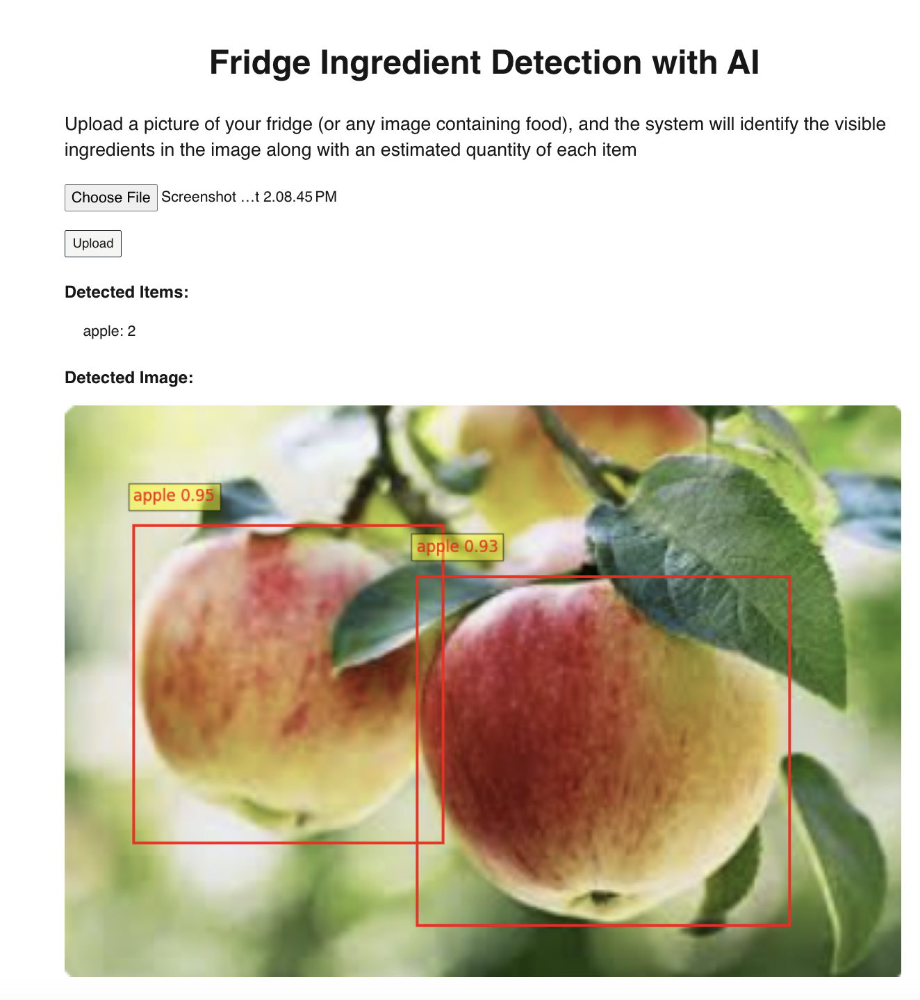
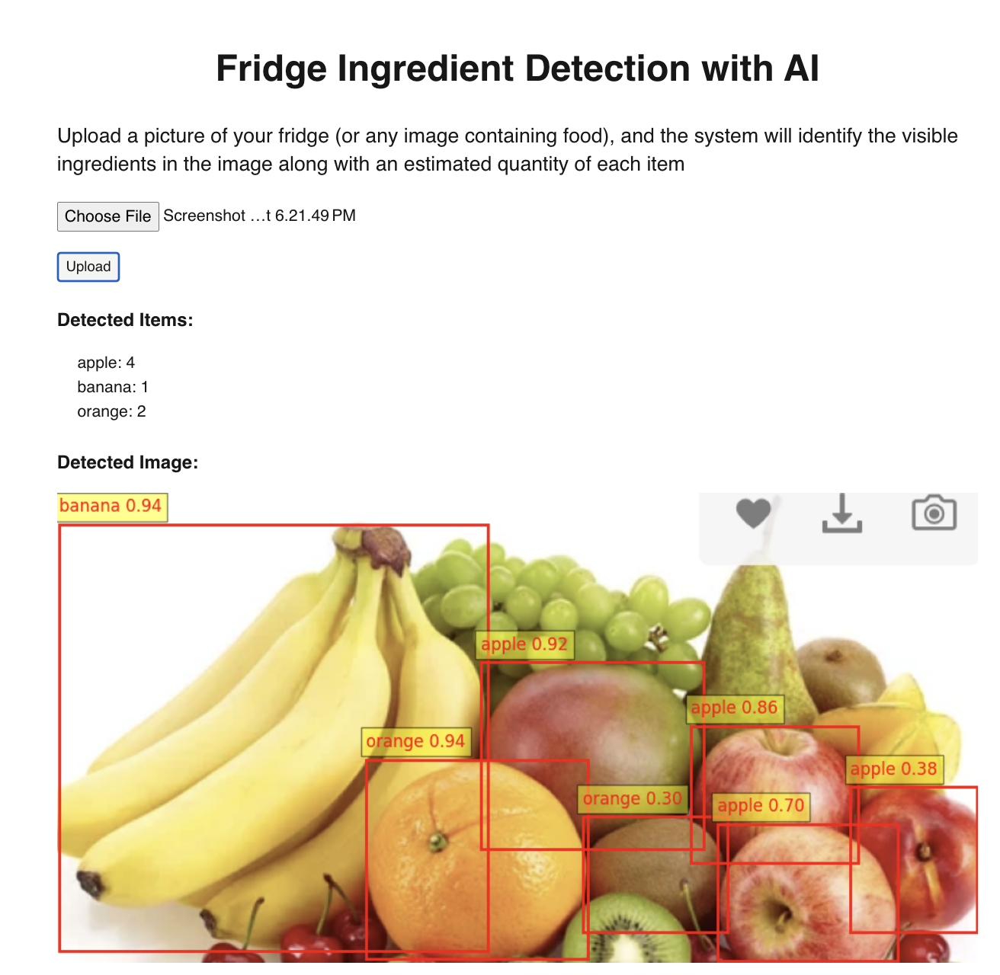

# Food Detector Project

This project consists of a frontend application (food_detector) and a machine learning backend (ml_backend) for detecting food in images.

## Prerequisites

- Node.js and npm (for frontend)
- Python 3.7+ (for backend)
- pip (Python package manager)

## Setup and Running

### Frontend (food_detector)

1. Navigate to the frontend directory:

   ```
   cd food_detector
   ```

2. Install dependencies:

   ```
   npm install
   ```

3. Run the development server:
   ```
   npm run dev
   ```

The frontend should now be running and accessible via a web browser.

### Backend (ml_backend)

1. Navigate to the backend directory:

   ```
   cd ml_backend
   ```

2. Create a virtual environment:

   ```
   python3 -m venv env
   ```

3. Activate the virtual environment:

   ```
   source env/bin/activate
   ```

4. Install required packages:

   ```
   pip install -r requirements.txt
   ```

5. Run the backend server:
   ```
   python3 main.py
   ```

The backend should now be running and ready to process requests from the frontend.

## Project Structure

- `food_detector/`: Web application with Next.js and Tailwind
- `ml_backend/`: Machine learning backend using python
  - `main.py`: Main entry point for the backend server
  - `ml_yolo.py`: YOLOv8 implementation for food detection
  - `yolov8l.pt`: YOLOv8 model weights
  - `requirements.txt`: Python dependencies

## Tech Stack
For the web application, I utilized Next.js along with Tailwind CSS to create a responsive and modern user interface. Next.js provides server-side rendering capabilities and a robust routing system, while Tailwind CSS offers utility-first styling, enabling rapid design adjustments. 

For the machine learning backend, I implemented FastAPI, which facilitates integration with the Python-based machine learning libraries I am using, including YOLOv8 for object detection. This stack allows for efficient communication between the front end and the ML model, ensuring quick response times and a smooth user experience for inventory detection tasks.


## Model Selection
I Employed a pre-trained **YOLOv8** model for real-time object detection, chosen for its speed and accuracy in identifying multiple objects within images. I chose YOLOv8 for inventory detection due to its excellent balance of speed and accuracy, making it ideal for real-time applications. Compared to other models like Faster R-CNN or SSD, YOLOv8 processes images quickly while maintaining high detection precision, which is crucial for managing inventory effectively. Its user-friendly implementation with pre-trained weights allows for easy integration and fine-tuning, making it adaptable to various environments.

## Any challenges faced during development and how they were resolved?

One significant challenge I encountered was the inability to deploy the application on Vercel or other free hosting services due to the large size of the machine learning model, which exceeded their limits for free deployments. This could be resolved by opting for a paid tier, specifically deploying the application on an AWS EC2 instance, which provides the necessary resources to accommodate the large model. 

 Additionally, I faced accuracy issues with the model, particularly when detecting items that were too close together or overlapping, which led to misclassifications. If I had more time and access to GPU resources, I could further customize the model specifically for food detection, enhancing its accuracy and performance in these challenging scenarios. This would enable a more tailored solution that better meets the unique needs of the application.



